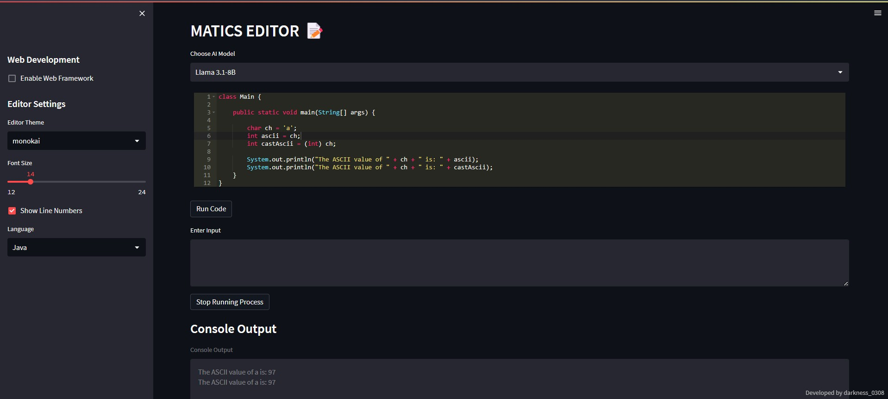

# Matics Editor

Matics Editor is a real-time AI-enhanced code editor and debugger built using **Streamlit**. It supports multiple programming languages, including **Python, Java, C, and C++**, along with **integrated AI debugging, code improvement, and web framework support** for Django, Flask, and Streamlit.

## ✨ Features  

- **Multi-language support**: Run **Python, Java, C, and C++** code.  
- **AI-powered debugging & enhancement**: Get **real-time AI suggestions** to improve your code.  
- **Multiple AI Models**: Choose from **Llama 3.1, Llama 3.2, DeepSeek, Mixtral, Qwen**, and more.  
- **Chat History Management**: Maintains previous **executions, errors, and AI feedback** for learning.  
- **Web framework execution**: Run **Django, Flask, and Streamlit** apps directly inside the editor.  
- **Real-time execution**: Compile and run code **instantly within the interface**.  
- **Customizable editor**: Change **themes, font sizes, and enable/disable line numbering**.  
- **Process management**: Start, stop, and **terminate executions on demand**.  

---

## 📸 Screenshots  

### Matics Editor - Home  
  

### Matics Editor - Output 
  

### Matics Editor - AI Feedback 
  

### Matics Editor - Web Frameworks 
  

### Matics Editor - Model Selection 
  

---

## 🚀 Installation  

### ✅ Prerequisites  
Ensure you have **Python 3.8+** installed. You may also need `gcc`, `g++`, and `openjdk-17-jdk` for compiling C, C++, and Java code.  

### 🛠 Install Dependencies  
Clone the repository and install required packages:  

```sh
git clone https://github.com/your-repo/matics-editor.git  
cd matics-editor  
pip install -r requirements.txt
```

For Linux users, install system dependencies:

```sh
sudo apt update && sudo apt install -y gcc g++ openjdk-17-jdk
```

## 🛠 Usage  
Run the Streamlit application:

```sh
streamlit run app.py
```

## 🌐 Running Web Frameworks  
- **Django**: Enter a project name and start a new Django project within the app.
- **Flask**: Write and execute Flask apps seamlessly.
- **Streamlit**: Run Streamlit apps directly inside Matics Editor.

## 📂 Project Structure  
```bash
Matics-Editor/
├── app.py              # Main Streamlit application
├── config.py           # Configuration settings
├── requirements.txt    # Project dependencies
├── images/             # UI screenshots
├── temp_files/         # Temporary execution files
└── README.md           # Project documentation
```

## 🔥 Supported AI Models  
Matics Editor integrates AI debugging and enhancement using multiple large language models:

| Model Name            | Description                              |
|-----------------------|------------------------------------------|
| Llama 3.1 8B         | Fast, accurate AI debugging assistance  |
| Llama 3.2 90B        | Advanced AI-powered code enhancement   |
| DeepSeek R1          | (Not recommended for coding)           |
| Mixtral 8x7B         | Powerful and precise debugging         |
| Qwen 2.5 Coder 32B   | AI tailored for coding improvements    |

You can choose the preferred AI model from the sidebar while coding.

## 👥 Contributors  
- **Kamal M** (learningcsc97@gmail.com)  
- **Rooban A** (asrooban98@gmail.com)  
- **Om Prakash S** (ombshss2005@gmail.com)  


## 📧 Contact  
For any questions, reach out to **learningcsc97@gmail.com**.
